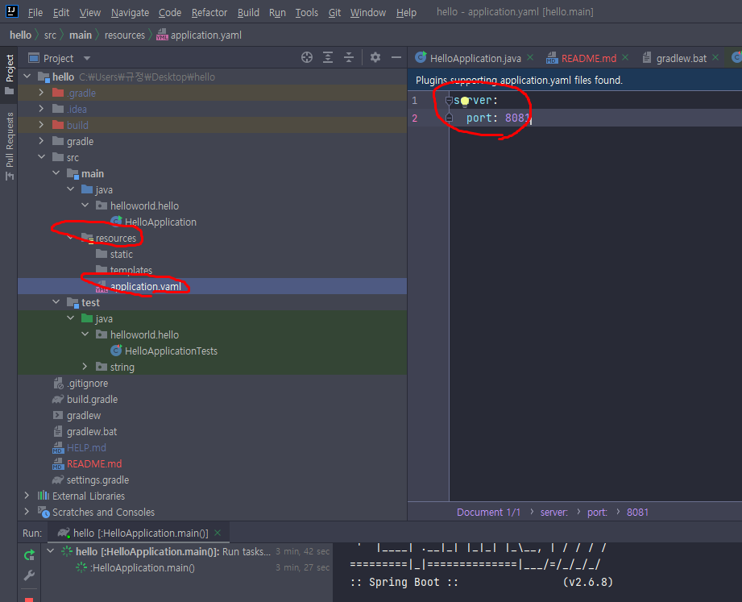

## < 스프링 >
### * 공부목표
1. 스프링을 어떻게 사용해야 하는지 익히기

### * 스프링을 공부하는 이유
1. 실무에서 제대로 동작하는 웹 어플리케이션을 개발하기 위해서

### * 스프링 로드맵
1. 스프링 입문
2. 스프링 핵심원리
3. 스프링 웹 MVC
4. 스프링 DB 데이터 접근 기술
5. 실전 스프링 부트

### * h2 데이터베이스 설치

### * 프로젝트 생성
1. http://start.spring.io 접속
2. 과거에는 Maven을 많이 썻지만 요즘에는 Gradle을 많이 씀
3. Artifact : 프로젝트명
4. 오른쪽 add 를 누르고 Spring web, Thymeleaf 추가
5. 아래 generate 클릭
* 내 컴퓨터는 oracle db가 포트번호 8088을 쓰고있기 때문에 포트번호를 8081로 바꿔서 쓰기로함
* 포트번호 바꾸는법
