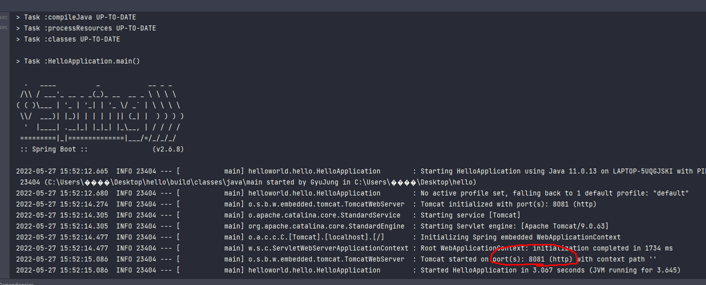
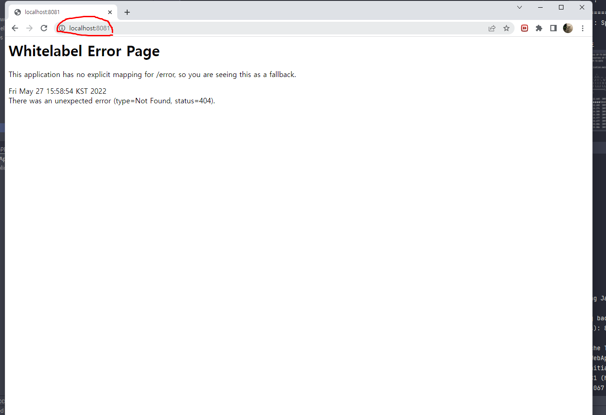
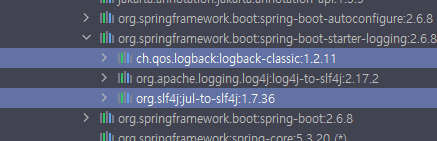

## < 스프링 >
### * 공부목표
1. 스프링을 어떻게 사용해야 하는지 익히기

### * 스프링을 공부하는 이유
1. 실무에서 제대로 동작하는 웹 어플리케이션을 개발하기 위해서

### * 스프링 로드맵
1. 스프링 입문
2. 스프링 핵심원리
3. 스프링 웹 MVC
4. 스프링 DB 데이터 접근 기술
5. 실전 스프링 부트

### * h2 데이터베이스 설치

### * 프로젝트 생성
1. http://start.spring.io 접속
2. 과거에는 Maven을 많이 썻지만 요즘에는 Gradle을 많이 씀
3. Artifact : 프로젝트명
4. 오른쪽 add 를 누르고 Spring web, Thymeleaf 추가
5. 아래 generate 클릭
* 내 컴퓨터는 oracle db가 포트번호 8088을 쓰고있기 때문에 포트번호를 8081로 바꿔서 쓰기로함
* 포트번호 바꾸는법

* gradle : 버전설정하고 라이브러리 땡겨옴
* 스프링부트 버젼 

* 포트번호

* 크롬에 localhost:8081 (8081은 포트번호)

* 여기까지가 프로젝트 환경설정 성공 

### * 라이브러리 살펴보기
1. thymeleaf : HTML 만들어주는 라이브러리
2. 로그에 관한게 궁금하면 logback과 slf4j검색해보기

3. 자바에서는 junit이라는 라이브러리를 테스트할때씀 스프링에서도 씀
* 스프링부트 라이브러리 핵심
  - spring-boot-starter-web
     1) spring-boot-starter-tomcat : 톰캣(웹서버)
     2) spring-webmvc : 스프링 웹 MVC
  - spring-boot-starter-thymeleaf : 타임리프 템플릿 엔진(view)
  - spring-boot-starter(공통) : 스프링 부트 + 스프링 코어 + 로깅
    - spring-boot
      - spring-core
    - spring-boot-starter-logging
      - logback, slf4j

* 테스트 라이브러리
  - spring-boot-starter-test
    - junit : 테스트 프레임워크(요즘에는 junit5를 씀)
    - mockito : 목 라이브러리
    - assertj : 테스트 코드를 좀 더 편하게 작성하게 도와주는 라이브러리
    - spring-test : 스프링 통합 테스트 지원
    
### * view 환경설정
1. 웰컴페이지 만들기
   - 파일명 index.html 만들기 (main -> resource -> static 여기에 만들기)
    
   - 스프링 부트가 제공하는 welcom Page 기능 ( spring.io에 들어간다 -> 메뉴에 프로젝트에 스프링부트에 들어간다 -> 들어가자마자 learn에 들어간다음 내버전의  reference document에 가서 스프링부트 피쳐로간다 거기서 검색)
     - static/index.html을 올려두면 Welcome page 기능을 제공한다.
   - java.helloworld.hello에 controller패키지를 만들고 그 안에 HelloController클래스를 만든다 그리고 resource안에 있는 templates에 hello.html파일을 만든다
   
   
### * 빌드하고 실행하기
1. ./gradlew build    잘 안되면 ./gradlew clean build : 빌드파일 지우고 다시하는 것 윈도우는 gradlew.bat 으로해야됨
2. cd build/libs
3. java -jar hello-spring-0.0.1-SNAPSHOT.jar 서버 배포시 파일 복사해서 이렇게 하면 서버에서도 스프링이 동작함
4. 실행 확인

### * 스프링 웹 개발 기초
1. 정적컨텐츠 : 그냥 파일을 그대로 고객한테 전달해주는것 웹브라우저에 전달해주는 것
2. MVC(Model, View, Controller)와 템플릿 엔진 : 서버에서 변형해서 HTML을 바꿔서 전달해주는 것
   - => 템플릿 엔진을 모델, 뷰, 컨트롤러 방식으로 쪼개서 뷰를 템플릿 엔진으로 html을 좀 더 프로그래밍 한걸로 랜더링해서 랜더링이 된 html을 고객에게 전달해준다
3. API : 서버와 데이터베이스에 대한 출입구 역할 및 모든 접속을 표준화시켜준다
- MVC
  1) View : 화면을 그리는데 모든 역량을 집중해야됨
  2) Controller : 비즈니스로직과 관련이 있거나 내부적인걸 처리하는데 집중
  3) Model : 관련된 화면에서 필요한 것들을 담아서 넘겨주는 것
4. JSON : 키 밸류로 이루어진 구조 (키 : 밸류)
5. @ResponseBody 를 사용
   - HTTP의 BODY에 문자 내용을 직접 반환
   - viewResolver 대신에 HttpMessageConverter 가 동작
   - 기본 문자처리: StringHttpMessageConverter
   - 기본 객체처리: MappingJackson2HttpMessageConverter
   - byte 처리 등등 기타 여러 HttpMessageConverter가 기본으로 등록되어 있음
   - 결론 : 요즘엔 거의 JASON만 쓴다.

### * 회원 관리 예제 - 백엔드 개발
