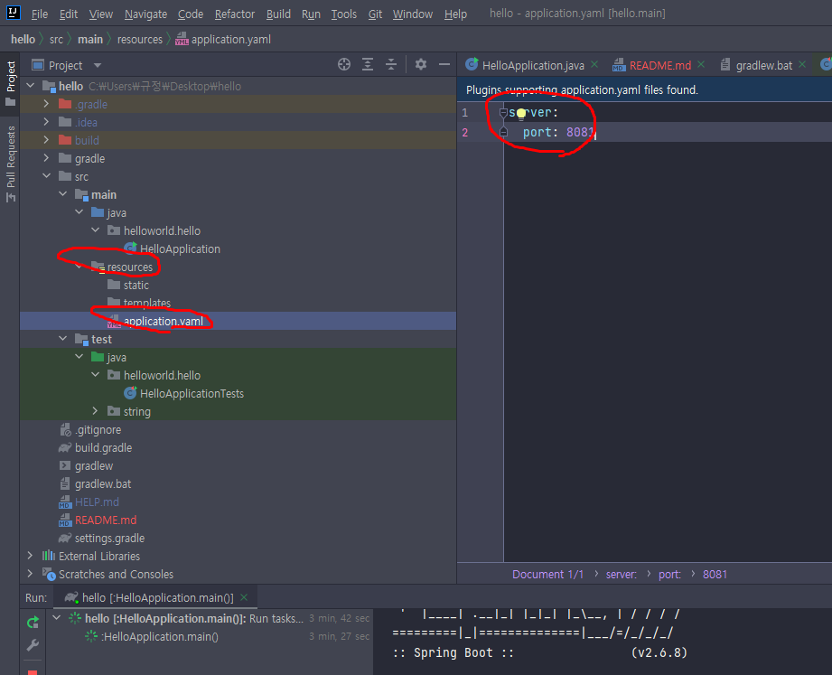
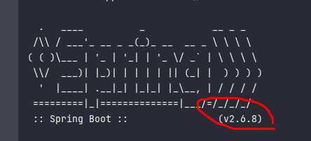
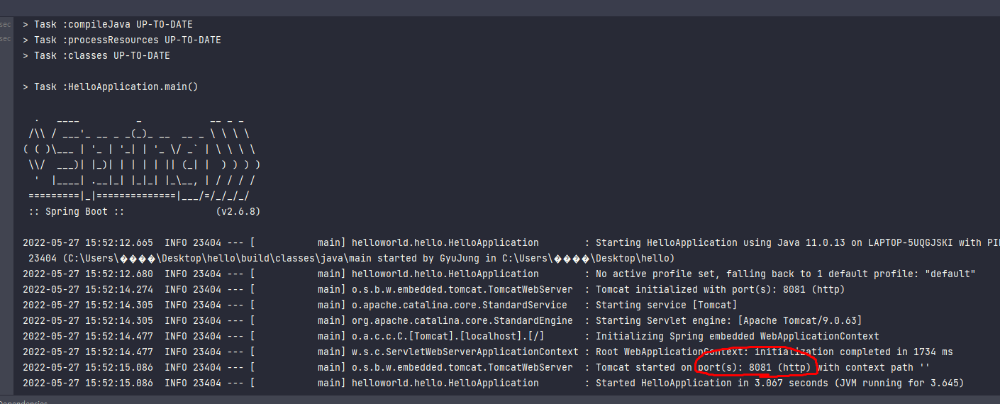
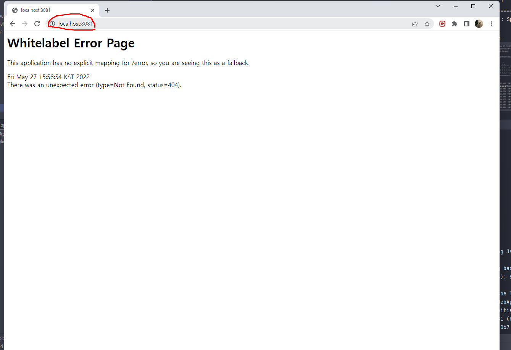
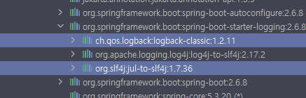
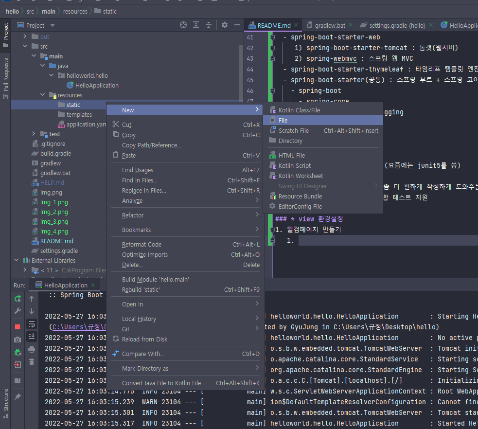
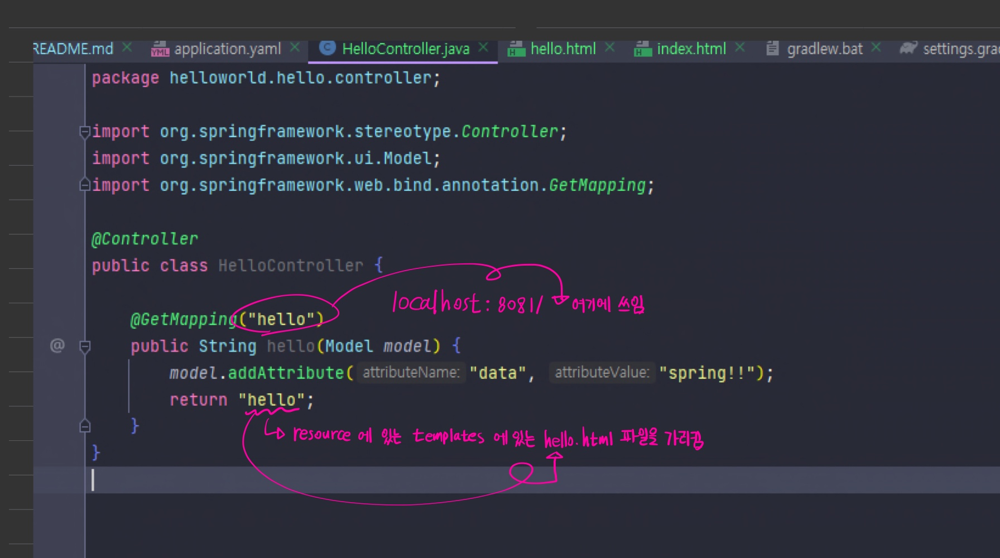

## < 스프링 >
### * 공부목표
1. 스프링을 어떻게 사용해야 하는지 익히기

### * 스프링을 공부하는 이유
1. 실무에서 제대로 동작하는 웹 어플리케이션을 개발하기 위해서

### * 스프링 로드맵
1. 스프링 입문
2. 스프링 핵심원리
3. 스프링 웹 MVC
4. 스프링 DB 데이터 접근 기술
5. 실전 스프링 부트

### * h2 데이터베이스 설치

### * 프로젝트 생성
1. http://start.spring.io 접속
2. 과거에는 Maven을 많이 썻지만 요즘에는 Gradle을 많이 씀
3. Artifact : 프로젝트명
4. 오른쪽 add 를 누르고 Spring web, Thymeleaf 추가
5. 아래 generate 클릭
* 내 컴퓨터는 oracle db가 포트번호 8088을 쓰고있기 때문에 포트번호를 8081로 바꿔서 쓰기로함
* 포트번호 바꾸는법

* gradle : 버전설정하고 라이브러리 땡겨옴
* 스프링부트 버젼 

* 포트번호

* 크롬에 localhost:8081 (8081은 포트번호)

* 여기까지가 프로젝트 환경설정 성공 

### * 라이브러리 살펴보기
1. thymeleaf : HTML 만들어주는 라이브러리
2. 로그에 관한게 궁금하면 logback과 slf4j검색해보기

3. 자바에서는 junit이라는 라이브러리를 테스트할때씀 스프링에서도 씀
* 스프링부트 라이브러리 핵심
  - spring-boot-starter-web
     1) spring-boot-starter-tomcat : 톰캣(웹서버)
     2) spring-webmvc : 스프링 웹 MVC
  - spring-boot-starter-thymeleaf : 타임리프 템플릿 엔진(view)
  - spring-boot-starter(공통) : 스프링 부트 + 스프링 코어 + 로깅
    - spring-boot
      - spring-core
    - spring-boot-starter-logging
      - logback, slf4j

* 테스트 라이브러리
  - spring-boot-starter-test
    - junit : 테스트 프레임워크(요즘에는 junit5를 씀)
    - mockito : 목 라이브러리
    - assertj : 테스트 코드를 좀 더 편하게 작성하게 도와주는 라이브러리
    - spring-test : 스프링 통합 테스트 지원
    
### * view 환경설정
1. 웰컴페이지 만들기
   - 파일명 index.html 만들기 (main -> resource -> static 여기에 만들기)
    
   - 스프링 부트가 제공하는 welcom Page 기능 ( spring.io에 들어간다 -> 메뉴에 프로젝트에 스프링부트에 들어간다 -> 들어가자마자 learn에 들어간다음 내버전의  reference document에 가서 스프링부트 피쳐로간다 거기서 검색)
     - static/index.html을 올려두면 Welcome page 기능을 제공한다.
   - java.helloworld.hello에 controller패키지를 만들고 그 안에 HelloController클래스를 만든다 그리고 resource안에 있는 templates에 hello.html파일을 만든다
   
   
### * 빌드하고 실행하기
1. ./gradlew build    잘 안되면 ./gradlew clean build : 빌드파일 지우고 다시하는 것 윈도우는 gradlew.bat 으로해야됨
2. cd build/libs
3. java -jar hello-spring-0.0.1-SNAPSHOT.jar 서버 배포시 파일 복사해서 이렇게 하면 서버에서도 스프링이 동작함
4. 실행 확인

### * 스프링 웹 개발 기초
1. 정적컨텐츠 : 그냥 파일을 그대로 고객한테 전달해주는것 웹브라우저에 전달해주는 것
2. MVC(Model, View, Controller)와 템플릿 엔진 : 서버에서 변형해서 HTML을 바꿔서 전달해주는 것
   - => 템플릿 엔진을 모델, 뷰, 컨트롤러 방식으로 쪼개서 뷰를 템플릿 엔진으로 html을 좀 더 프로그래밍 한걸로 랜더링해서 랜더링이 된 html을 고객에게 전달해준다
3. API : 서버와 데이터베이스에 대한 출입구 역할 및 모든 접속을 표준화시켜준다
- MVC
  1) View : 화면을 그리는데 모든 역량을 집중해야됨
  2) Controller : 비즈니스로직과 관련이 있거나 내부적인걸 처리하는데 집중
  3) Model : 관련된 화면에서 필요한 것들을 담아서 넘겨주는 것
4. JSON : 키 밸류로 이루어진 구조 (키 : 밸류)
5. @ResponseBody 를 사용
   - HTTP의 BODY에 문자 내용을 직접 반환
   - viewResolver 대신에 HttpMessageConverter 가 동작
   - 기본 문자처리: StringHttpMessageConverter
   - 기본 객체처리: MappingJackson2HttpMessageConverter
   - byte 처리 등등 기타 여러 HttpMessageConverter가 기본으로 등록되어 있음
   - 결론 : 요즘엔 거의 JASON만 쓴다.

### * 회원 관리 예제 - 백엔드 개발

### * 스프링 빈과 의존관계
- 스프링빈을 등록하는데는 2가지 방법이 있다
  1) 컴포넌트 스캔과 자동의존관계 설정
     - (@Controller, @Service, @Repository)(사실 @Service대신 @Component라고 하면된다. 그런데 Service를 해도 되는 이유는 그 안에 들어가보면 Conponent가 있다, Controller도 마찬가지, Repository도 마찬가지)
     - 정리) 스프링이 딱 올라올 때 컴포넌트가 들어가있는 에너테이션을 가지고 있는 애들은 다 스프링이 객체를 하나씩 생성을 해서 스프링컨테이너에 다 등록을 해준다 
     - 그리고 Autowired는 그 컨테이너의 객체들간에 연관관계의 선을 연결해준다 그래서 멤버 컨트롤러가 멤버 서비스를 쓸수있게해주는것
     - 하지만 아무 패키지나 만들어서 @Service, @Component를 한다고해서 컨테이너에 등록되진 않는다 HelloApplicationTests부터 시작해서 그 클래스가 속한 패키지 안에 있는 하위들은 자동으로 스프링이 다 뒤져서 빈에 등록하는데 하위패키지가 동일하거나 하위패키지가아닌애들은 스프링빈으로 컴포넌트스캔안함 
     - 물론 어떤설정을 해주면 등록이되는데 기본적으로 되지않음
     - 스프링은 스프링 컨테이너에 스프링빈을 등록시 싱글톤으로 등록함 이것은 유일하게 하나만 컨테이너에 등록한다는 뜻 따라서 같은 스프링빈이면 같은 인스턴스임
  2) 자바 코드로 직접 스프링 빈 등록하기
- 화면을 붙이고 싶은데 그럴라면 컨트롤러랑 뷰템플릿이 필요 (회원가입하고 회원가입된결과를 html로 뿌려주고)
- 그럴려면 멤버 컨트롤러를 만들어야됨 이 멤버 컨트롤러가 멤버 서비스를 통해서 회원가입하고 데이터를 조회할 수 있어야함 그렇게 되는걸 서로 의존관계가 있다고 말함
- 그 작업을 스프링스럽게 해보자!
1) 먼저 controller에 MemberController를 만든다
2) 그러고 멤버컨트롤러에 @Controller를 넣어주면 스프링 컨테이너라는 통이생기는데 거기에 이 컨트롤러 에너테이션이 있으면 이 멤버컨트롤러의 객체를 생성해서 컨테이너에 넣어준다
3) 그리고 스프링이 관리를 한다
4) 멤버컨트롤러도 스프링 컨테이너가 관리를 하게되는데 멤버컨트롤러가 멤버서비스를 가져다 쓰려고할때 new로 객체를 생성해서 쓸 수도 있다 
5) 하지만 스프링으로 관리를하게되면 다 스프링 컨테이너에 등록을 하고 스프링 컨테이너로부터 받아서쓰도록 이제 바꿔야한다 
6) 왜냐하면 이렇게 new로 객체를 생성하면 멤버컨트롤러뿐만아니라 다른 여러 컨트롤러들이 멤버서비스를 가져다 쓸 수 있다 
7) 멤버서비스는 그냥 하나만 생성해놓고 그냥 같이 공용으로 쓰면됨 그래서 new로 쓰지말고 스프링 컨테이너에 멤버서비스를 등록해놓고 쓰면된다
8) 그럴려면 우선 멤버서비스 생성자를 만들고 거기위에 에너테이션 Autowired를 달아준다 그렇게되면 스프링이 멤버서비스를 스프링컨테이너에서 가져다가 연결을 해준다
9) 근데 Autowired만 달아주면 멤버서비스를 찾을 수 없다고 뜬다 왜냐하면 스프링 컨테이너에 멤버서비스가 등록이 안되어있기 때문이다
10) 멤버서비스클래스는 현재 순수한 자바 코드이기 때문에 @Service를 넣어줘야된다 이걸 넣어줘야 스프링이 멤버서비르를 스프링 컨테이너에 등록해준다
11) 그러고 레포지토리를 구현한 클래스에 가서  @Repository를 넣어주면 스프링이 뜰때 이 레포지토리서비스를 가져온다
12) @Autowired를 생성자에 쓰면 멤버컨트롤러가 생성이 될 때 @service로 인해 스프링빈에 등록되어있는 멤버서비스객체를 가져다준다 이것이 바로 디펜던시 인젝션이다.
13) 의존관계를 주입해주는것 뭔가 밖에서 스프링이 넣어주는것같은 느낌
14) 멤버서비스에있는 멤버서비스생성자에도 @Autowired를 넣어주면 멤버서비스를 스프링이 생성을 할 때 오 @Service네 하고 스프링 컨테이너에 등록을 하면서 멤버서비스 생성자를 호출을한다 근데 그때 생성자에 @Autowired가 있으면 아 너는 멤버 리포지토리가 필요하구나 하면서
15) 스프링 컨테이너에 잇는 멤버 리포지토리를 넣어준다. 이때 리포지토리를 구현한 클래스에는 @Repository의 에너테이션이 들어가있어야한다.

### * 자바 코드로 직접 스프링 빈 등록하기
1) HelloApplication과 같은 패키지에 SpringConfig라는 클래스를 생성해준뒤
2) SpringConfig위에 @Configuration을 붙여주고 아래 스프링컨테이너에 등록해야하는 것들을 생성자로 생성
3) MemberService의 생성자를 만들고 그 위에 @Bean을 붙여준다
4) 똑같이 아래에 MemberRepository의 생성자를 만들고 @Bean을 붙여준다 그러고나서
5) MemberService는 MemberRepository를 사용해야하므로 매개변수에 memberRepository()을 넣어준다
6) 여기서 memberRepository()는 @Bean에 의해 컨테이너에 객체로 등록이 되었기 때문에 MemberService의 매개변수객체로 사용이 가능한 것이다.

- 디펜던시인젝션의 3가지방법
  1) 생성자 주입 - 생성자를통해서 들어오는 방식 - 생성자를 통해 MemberService가 MemberController에 주입이 된다.
  2) 필드 주입 - 생성자를 빼고 필드(private final MemberService memberService;) 에다가 @Autowired를 붙이는 방법 - 별로 안좋음 뭔가 바꿀 수 있는 방법이 없음
  3) setter주입 

### * 회원 웹 기능 조회
- URL창에다 엔터 딱 치는건 GetMapping
- PostMapping : 데이터를 Form같은데 넣어서 전달할때 씀
- GetMapping : 전달할때 씀

### * 회원 웹 기능 조회

## * 스프링 DB 접근 기술

### * H2 데이터베이스 설치

### * yaml 파일일때는 
- spring:
- datasource:
- url: jdbc:h2:tcp://localhost/~/test
- driver-class-name:org: org.h2.Driver
- username: sa

### * properties 파일일때는
- spring.datasource.url=jdbc:h2:tcp://localhost/~/test
- spring.datasource.driver-class-name=org.h2.Driver
- spring.datasource.username=sa

### * 스프링 통합 테스트
- 스프링컨테이너랑, DB까지해서 통합으로 테스트를 하는것(하지만 통합테스트말고 단위테스트를 잘 하는게 더 좋다)
- @SpringBootTest : 스프링 컨테이너와 테스트를 함께 실행한다.
- @Transactional : 테스트 케이스에 이 애노테이션이 있으면, 테스트 시작 전에 트랜잭션을 시작하고,
테스트 완료 후에 항상 롤백한다. 이렇게 하면 DB에 데이터가 남지 않으므로 다음 테스트에 영향을 주지
않는다.

### * 스프링 JdbcTemplate
- Jdbc -> JdbcTemplate으로 바꾸면서 개발해야되는 반복적인 코드가 확 줄었다, 하지만 sql쿼리는 개발자가 직접 작성을해야한다

### * Jpa(자바 퍼시스턴스 API)
- sql 쿼리마져 Jpa가 자동으로 처리해줌
- 따라서 SQL과 데이터 중심의 설계에서 객체 중심의 설계로 패러다임을 전환할 수 있다.
- 얘는 인터페이스임